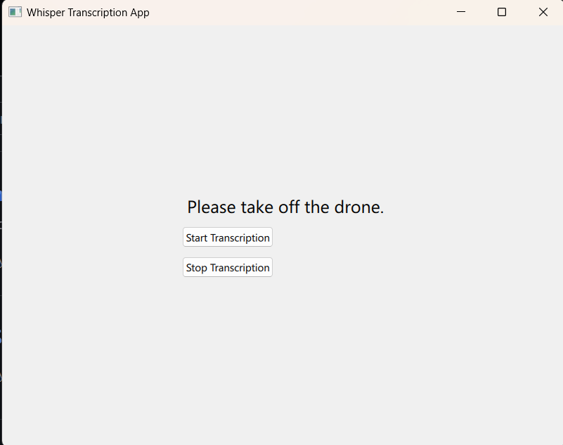

# whisper-trial
tried out openai's whisper tiny for audio transcription

NOTE : This only runs locally as there is a requirement of ffmpeg.

you will need ffmpeg installed before running this locally.

```
choco install ffmpeg
```

or 

```
pip install ffmpeg-python
```


you can find the qml file and qt widget for whisper transcription in the repo.



